New-method_NGGF_Final
================
kvirbhadra
08/08/2022

################################################################################# 

Important resources:

-   The [DADA2 Website](https://benjjneb.github.io/dada2/index.html)
-   The [DADA2 tutorial
    workflow](https://benjjneb.github.io/dada2/tutorial.html)
-   The [DADA2 Issues forum](https://github.com/benjjneb/dada2/issues)
-   The \[DADA2 Installation\]
    (<https://benjjneb.github.io/dada2/dada-installation.html>)

# The DADA2 Workflow

Preprocessing -\> Filter and Trim -\>Learn Error Rates -\>Denoise/Sample
Inference -\>Merge (if paired-end) -\>Remove Chimeras -\>Assign Taxonomy

Throughout: Sanity checks!

# Preprocessing, Filtering and Trimming

Trimming using in house tool MetReTrim, with options to trim primers as
well as adapters with ‘N (0-10)’ heterogeneity spacers.In our case we
performed primer trimming in DADA2. Before starting with DADA2 pipeline
it should be ensured that: - Samples have been demultiplexed, i.e. split
into individual per-sample fastq files. - Non-biological nucleotides
have been removed, e.g. primers, adapters, linkers, etc. - If paired-end
sequencing data, the forward and reverse fastq files contain reads in
matched order.

``` r
library(dada2); packageVersion("dada2")
```

    ## Loading required package: Rcpp

    ## [1] '1.24.0'

``` r
path <- "F:/R-DADA2/New_method_NGGF/WC_New_Method/Data"
```

Verifying files present in working directory, sorting and extracting
sample names.Extracting sample names, assuming file names have format:
SAMPLENAME_XX.fastq.gz

0N -\> Illumina standard method 10N -\> ‘N’(0-10) spacer-linked method

# Food for thoughts

coi? trnL? amoA? ITS1? ITS2? cpn60? 18S? … 16S: v1-v2? v1-v3? v4? v3-v4?
v4-v5? …

How long is it? Length variation?

Did you sequence your primers? Are you sure?

Note: Reads for our methods are trimmed of heterogeneity spacers using
MetReTrim (Ver:1). Output file for MetReTrim contains “trimmed” as
extension just before “.fastq”. User can either manually edit the files
or modify the code to read MetReTrim processed files here. No change
needed for standard Illumina method since those reads do not require
MetReTrim processing.

``` r
list.files(path)
```

    ##  [1] "Abundance Data.csv"                 "Data prune.xlsx"                   
    ##  [3] "Mock-0N-T1_S1_L001_R1_001.fastq.gz" "Mock-0N-T1_S1_L001_R2_001.fastq.gz"
    ##  [5] "Mock-0N-T2_S2_L001_R1_001.fastq.gz" "Mock-0N-T2_S2_L001_R2_001.fastq.gz"
    ##  [7] "Mock-0N-T3_S3_L001_R1_001.fastq.gz" "Mock-0N-T3_S3_L001_R2_001.fastq.gz"
    ##  [9] "Mock-0N-T4_S4_L001_R1_001.fastq.gz" "Mock-0N-T4_S4_L001_R2_001.fastq.gz"
    ## [11] "Mock-10N-T1_S1_L001_R1_001.fastq"   "Mock-10N-T1_S1_L001_R2_001.fastq"  
    ## [13] "Mock-10N-T2_S2_L001_R1_001.fastq"   "Mock-10N-T2_S2_L001_R2_001.fastq"  
    ## [15] "Mock-10N-T3_S3_L001_R1_001.fastq"   "Mock-10N-T3_S3_L001_R2_001.fastq"  
    ## [17] "Mock-10N-T4_S4_L001_R1_001.fastq"   "Mock-10N-T4_S4_L001_R2_001.fastq"

``` r
fnFs <- sort(list.files(path, pattern="_R1_001.fastq", full.names = TRUE))
fnRs <- sort(list.files(path, pattern="_R2_001.fastq", full.names = TRUE))
sample.names <- sapply(strsplit(basename(fnFs), "_"), `[`, 1)
head(sample.names)
```

    ## [1] "Mock-0N-T1"  "Mock-0N-T2"  "Mock-0N-T3"  "Mock-0N-T4"  "Mock-10N-T1"
    ## [6] "Mock-10N-T2"

# Quality profile plots

Plotting quality profiles of reads to visually estimate the cutting
parameters since “figaro” cannot be used with varying length reads.
Quality profile plotting should range from 1 to N where N is the total
number of samples whose reads are in working directory.

``` r
plotQualityProfile(fnFs[1:10])
```

    ## Warning: `guides(<scale> = FALSE)` is deprecated. Please use `guides(<scale> =
    ## "none")` instead.

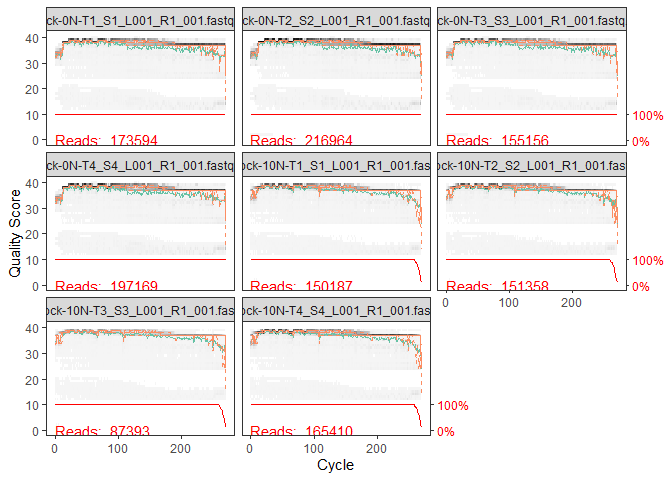<!-- -->

``` r
plotQualityProfile(fnRs[1:10])
```

    ## Warning: `guides(<scale> = FALSE)` is deprecated. Please use `guides(<scale> =
    ## "none")` instead.

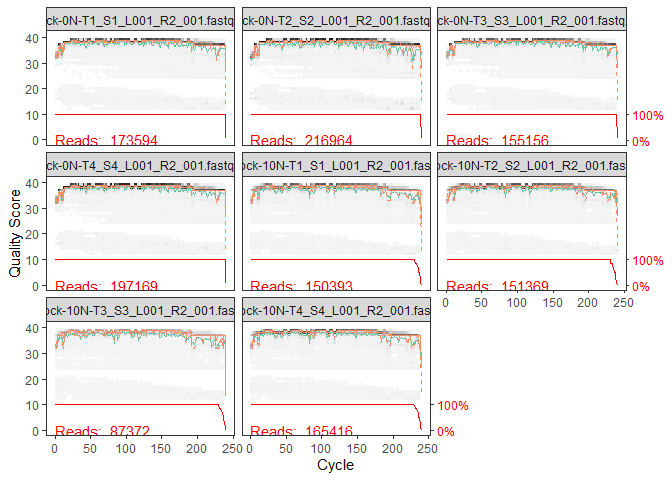<!-- -->

# Filter and Trim

Next step is filtering and trimming data based on quality scores.
“trunclen” should be visually assessed observing the quality of
cumulative Read 1 and Read 2 for each sample and keeping Phred score
above 20 atleast. For our datasets we estimated 260 to be an appropriate
cutoff for Read 1 and 230 for read 2.

maxEE parameter was a bit relaxed (default=2) for reverse reads than in
the DADA2 tutorial considering lower quality of reverse reads in
amplicon sequencing. matchIDs were enabled and kept True since total
number of R1 and R2 sometimes didn’t tally after processing with
MetReTrim.

For further details consult the Filter and Trim section in the
documentation available on DADA2 website.Primer trimming for all the
reads are performed here.

``` r
filtFs <- file.path(path, "filtered", paste0(sample.names, "_F_filt.fastq.gz"))
filtRs <- file.path(path, "filtered", paste0(sample.names, "_R_filt.fastq.gz"))
names(filtFs) <- sample.names
names(filtRs) <- sample.names
out <- filterAndTrim(fnFs, filtFs, fnRs, filtRs, truncLen=c(260,230),
                     maxN=0, maxEE=c(2,5), truncQ=2, rm.phix=TRUE,
                     compress=TRUE, multithread=FALSE, matchIDs=TRUE, trimLeft = c(17,21)) #Set multithread=TRUE to use all cores
```

    ## Creating output directory: F:/R-DADA2/New_method_NGGF/WC_New_Method/Data/filtered

# Assessing the quality of the filtered reads

**Questions**

-   What fraction of reads were kept?
-   Was that fraction reasonably consistent among samples?
-   Were enough reads kept to achieve your analysis goals?

``` r
head(out)
```

    ##                                    reads.in reads.out
    ## Mock-0N-T1_S1_L001_R1_001.fastq.gz   173594    151211
    ## Mock-0N-T2_S2_L001_R1_001.fastq.gz   216964    187940
    ## Mock-0N-T3_S3_L001_R1_001.fastq.gz   155156    135164
    ## Mock-0N-T4_S4_L001_R1_001.fastq.gz   197169    171701
    ## Mock-10N-T1_S1_L001_R1_001.fastq     150187    129559
    ## Mock-10N-T2_S2_L001_R1_001.fastq     151358    131226

``` r
plotQualityProfile(filtFs,aggregate=TRUE)
```

    ## Warning: `guides(<scale> = FALSE)` is deprecated. Please use `guides(<scale> =
    ## "none")` instead.

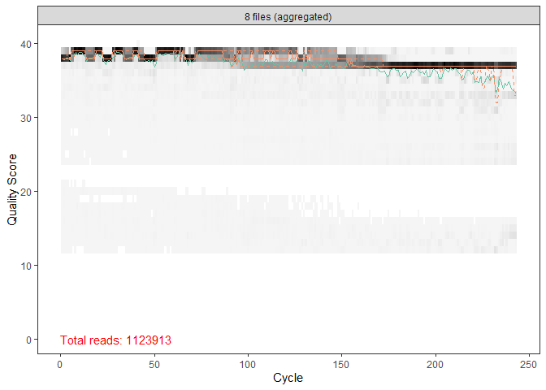<!-- -->

``` r
plotQualityProfile(filtRs,aggregate=TRUE)
```

    ## Warning: `guides(<scale> = FALSE)` is deprecated. Please use `guides(<scale> =
    ## "none")` instead.

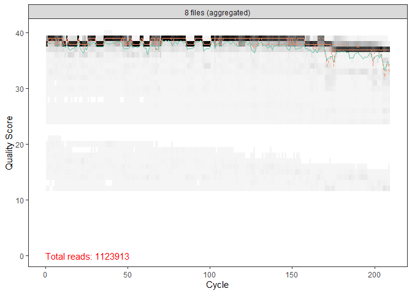<!-- -->

# Error function and sanity checks!

Learning error rates and denoising data. This step took a while.

**Questions**

-   Does the model (red line) reasonably fit the observations (black
    points)?
-   Do the error rates mostly decrease with quality score?

``` r
errF <- learnErrors(filtFs, multithread=TRUE)
```

    ## 115258545 total bases in 474315 reads from 3 samples will be used for learning the error rates.

``` r
errR <- learnErrors(filtRs, multithread=TRUE)
```

    ## 135017344 total bases in 646016 reads from 4 samples will be used for learning the error rates.

``` r
plotErrors(errF, nominalQ=TRUE)
```

    ## Warning: Transformation introduced infinite values in continuous y-axis
    ## Transformation introduced infinite values in continuous y-axis

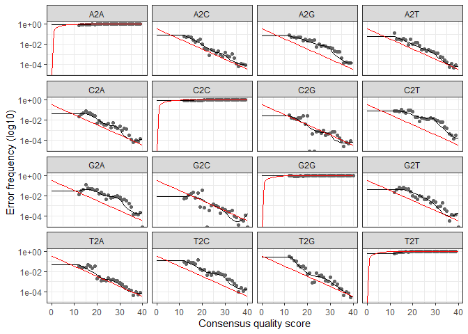<!-- -->

``` r
plotErrors(errR, nominalQ=TRUE)
```

    ## Warning: Transformation introduced infinite values in continuous y-axis
    ## Transformation introduced infinite values in continuous y-axis

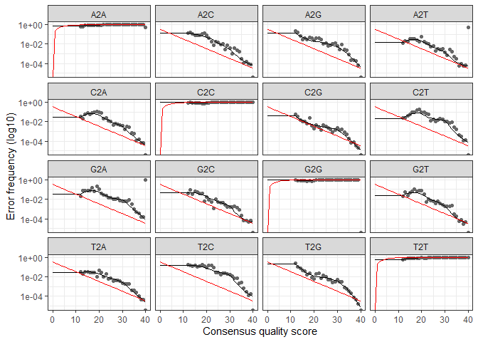<!-- -->

``` r
dadaFs <- dada(filtFs, err=errF, multithread=TRUE)
```

    ## Sample 1 - 151211 reads in 15936 unique sequences.
    ## Sample 2 - 187940 reads in 18259 unique sequences.
    ## Sample 3 - 135164 reads in 14708 unique sequences.
    ## Sample 4 - 171701 reads in 17250 unique sequences.
    ## Sample 5 - 129559 reads in 8991 unique sequences.
    ## Sample 6 - 131226 reads in 9277 unique sequences.
    ## Sample 7 - 75139 reads in 6298 unique sequences.
    ## Sample 8 - 141973 reads in 9637 unique sequences.

``` r
dadaRs <- dada(filtRs, err=errR, multithread=TRUE)
```

    ## Sample 1 - 151211 reads in 13035 unique sequences.
    ## Sample 2 - 187940 reads in 21868 unique sequences.
    ## Sample 3 - 135164 reads in 10707 unique sequences.
    ## Sample 4 - 171701 reads in 13289 unique sequences.
    ## Sample 5 - 129559 reads in 12407 unique sequences.
    ## Sample 6 - 131226 reads in 11093 unique sequences.
    ## Sample 7 - 75139 reads in 8949 unique sequences.
    ## Sample 8 - 141973 reads in 12594 unique sequences.

``` r
dadaFs[[1]]
```

    ## dada-class: object describing DADA2 denoising results
    ## 233 sequence variants were inferred from 15936 input unique sequences.
    ## Key parameters: OMEGA_A = 1e-40, OMEGA_C = 1e-40, BAND_SIZE = 16

The `getSequences` and `getUniques` functions work on just about any
dada2-created object. `getUniques` returns an integer vector, named by
the sequences and valued by their abundances. While,`getSequences` just
returns the sequences.

``` r
head(getSequences(dadaFs[[1]]))
```

    ## [1] "TAGGGAATCTTCCGCAATGGACGAAAGTCTGACGGAGCAACGCCGCGTGAGTGATGAAGGTTTTCGGATCGTAAAGCTCTGTTGTTAGGGAAGAACAAGTACCGTTCGAATAGGGCGGTACCTTGACGGTACCTAACCAGAAAGCCACGGCTAACTACGTGCCAGCAGCCGCGGTAATACGTAGGTGGCAAGCGTTGTCCGGAATTATTGGGCGTAAAGGGCTCGCAGGCGGTTCCTTAAGTC"
    ## [2] "TAGGGAATCTTCCGCAATGGACGAAAGTCTGACGGAGCAACGCCGCGTGTATGAAGAAGGTTTTCGGATCGTAAAGTACTGTTGTTAGAGAAGAACAAGGATAAGAGTAACTGCTTGTCCCTTGACGGTATCTAACCAGAAAGCCACGGCTAACTACGTGCCAGCAGCCGCGGTAATACGTAGGTGGCAAGCGTTGTCCGGATTTATTGGGCGTAAAGCGCGCGCAGGCGGTCTTTTAAGTCT"
    ## [3] "TAGGGAATCTTCCGCAATGGGCGAAAGCCTGACGGAGCAACGCCGCGTGAGTGATGAAGGTCTTCGGATCGTAAAACTCTGTTATTAGGGAAGAACATATGTGTAAGTAACTGTGCACATCTTGACGGTACCTAATCAGAAAGCCACGGCTAACTACGTGCCAGCAGCCGCGGTAATACGTAGGTGGCAAGCGTTATCCGGAATTATTGGGCGTAAAGCGCGCGTAGGCGGTTTTTTAAGTCT"
    ## [4] "TGGGGAATATTGCACAATGGGCGCAAGCCTGATGCAGCCATGCCGCGTGTATGAAGAAGGCCTTCGGGTTGTAAAGTACTTTCAGCGGGGAGGAAGGGAGTAAAGTTAATACCTTTGCTCATTGACGTTACCCGCAGAAGAAGCACCGGCTAACTCCGTGCCAGCAGCCGCGGTAATACGGAGGGTGCAAGCGTTAATCGGAATTACTGGGCGTAAAGCGCACGCAGGCGGTTTGTTAAGTCA"
    ## [5] "TGGGGAATATTGCACAATGGGCGCAAGCCTGATGCAGCCATGCCGCGTGTATGAAGAAGGCCTTCGGGTTGTAAAGTACTTTCAGCGGGGAGGAAGGTGTTGTGGTTAATAACCGCAGCAATTGACGTTACCCGCAGAAGAAGCACCGGCTAACTCCGTGCCAGCAGCCGCGGTAATACGGAGGGTGCAAGCGTTAATCGGAATTACTGGGCGTAAAGCGCACGCAGGCGGTCTGTCAAGTCG"
    ## [6] "TAGGGAATCTTCGGCAATGGACGAAAGTCTGACCGAGCAACGCCGCGTGAGTGAAGAAGGTTTTCGGATCGTAAAACTCTGTTGTTAGAGAAGAACAAGGACGTTAGTAACTGAACGTCCCCTGACGGTATCTAACCAGAAAGCCACGGCTAACTACGTGCCAGCAGCCGCGGTAATACGTAGGTGGCAAGCGTTGTCCGGATTTATTGGGCGTAAAGCGAGCGCAGGCGGTTTCTTAAGTCT"

``` r
head(getSequences(dadaRs[[1]]))
```

    ## [1] "TGTTCGCTCCCCACGCTTTCGCTCCTCAGCGTCAGTTACAGACCAGAGAGTCGCCTTCGCCACTGGTGTTCCTCCACATCTCTACGCATTTCACCGCTACACGTGGAATTCCACTCTCCTCTTCTGCACTCAAGTTCCCCAGTTTCCAATGACCCTCCCCGGTTGAGCCGGGGGCTTTCACATCAGACTTAAGGAACCGCCTGCGAGCC"
    ## [2] "TGTTTGATCCCCACGCTTTCGCACATCAGCGTCAGTTACAGACCAGAAAGTCGCCTTCGCCACTGGTGTTCCTCCATATCTCTGCGCATTTCACCGCTACACATGGAATTCCACTTTCCTCTTCTGCACTCAAGTTTTCCAGTTTCCAATGACCCTCCACGGTTGAGCCGTGGGCTTTCACATCAGACTTAAAAAACCGCCTACGCGCG"
    ## [3] "TGTTTGCTCCCCACGCTTTCGCGCCTCAGCGTCAGTTACAGACCAGAGAGTCGCCTTCGCCACTGGTGTTCCTCCACATATCTACGCATTTCACCGCTACACGTGGAATTCCACTCTCCTCTTCTGCACTCCAGTCTTCCAGTTTCCAATGACCCTCCCCGGTTAAGCCGGGGGCTTTCACATCAGACTTAAAAGACCGCCTGCGCGCG"
    ## [4] "TGTTTGCTCCCCACGCTTTCGCACCTGAGCGTCAGTCTTCGTCCAGGGGGCCGCCTTCGCCACCGGTATTCCTCCAGATCTCTACGCATTTCACCGCTACACCTGGAATTCTACCCCCCTCTACGAGACTCAAGCTTGCCAGTATCAGATGCAGTTCCCAGGTTGAGCCCGGGGATTTCACATCTGACTTAACAAACCGCCTGCGTGCG"
    ## [5] "TGTTTGCTCCCCACGCTTTCGCACCTGAGCGTCAGTCTTTGTCCAGGGGGCCGCCTTCGCCACCGGTATTCCTCCAGATCTCTACGCATTTCACCGCTACACCTGGAATTCTACCCCCCTCTACAAGACTCAAGCCTGCCAGTTTCGAATGCAGTTCCCAGGTTGAGCCCGGGGATTTCACATCCGACTTGACAGACCGCCTGCGTGCG"
    ## [6] "TGTTTGCTCCCCACGCTTTCGAGCCTCAGCGTCAGTTACAGACCAGAGAGCCGCCTTCGCCACTGGTGTTCCTCCATATATCTACGCATTTCACCGCTACACATGGAATTCCACTCTCCTCTTCTGCACTCAAGTCTCCCAGTTTCCAATGACCCTCCCCGGTTGAGCCGGGGGCTTTCACATCAGACTTAAGAAACCGCCTGCGCTCG"

# Merging, Tabulating and, Removing Chimeras:

Merging of forward and reverse filtered reads. After mergers look into
the data frame created to check for overlaps. More that sufficient
overlap was there for reads from both the runs.

``` r
mergers <- mergePairs(dadaFs, filtFs, dadaRs, filtRs, verbose=TRUE)
```

    ## 140089 paired-reads (in 514 unique pairings) successfully merged out of 150443 (in 1002 pairings) input.

    ## 175569 paired-reads (in 557 unique pairings) successfully merged out of 187030 (in 1187 pairings) input.

    ## 125178 paired-reads (in 458 unique pairings) successfully merged out of 134441 (in 845 pairings) input.

    ## 159663 paired-reads (in 574 unique pairings) successfully merged out of 170810 (in 1063 pairings) input.

    ## 123169 paired-reads (in 304 unique pairings) successfully merged out of 128391 (in 508 pairings) input.

    ## 124652 paired-reads (in 398 unique pairings) successfully merged out of 130568 (in 610 pairings) input.

    ## 71357 paired-reads (in 206 unique pairings) successfully merged out of 74668 (in 367 pairings) input.

    ## 135668 paired-reads (in 346 unique pairings) successfully merged out of 140950 (in 569 pairings) input.

``` r
head(mergers[[1]])
```

    ##                                                                                                                                                                                                                                                                                                                                                                                                                                       sequence
    ## 1 TAGGGAATCTTCCGCAATGGACGAAAGTCTGACGGAGCAACGCCGCGTGAGTGATGAAGGTTTTCGGATCGTAAAGCTCTGTTGTTAGGGAAGAACAAGTACCGTTCGAATAGGGCGGTACCTTGACGGTACCTAACCAGAAAGCCACGGCTAACTACGTGCCAGCAGCCGCGGTAATACGTAGGTGGCAAGCGTTGTCCGGAATTATTGGGCGTAAAGGGCTCGCAGGCGGTTCCTTAAGTCTGATGTGAAAGCCCCCGGCTCAACCGGGGAGGGTCATTGGAAACTGGGGAACTTGAGTGCAGAAGAGGAGAGTGGAATTCCACGTGTAGCGGTGAAATGCGTAGAGATGTGGAGGAACACCAGTGGCGAAGGCGACTCTCTGGTCTGTAACTGACGCTGAGGAGCGAAAGCGTGGGGAGCGAACA
    ## 2  TAGGGAATCTTCCGCAATGGACGAAAGTCTGACGGAGCAACGCCGCGTGTATGAAGAAGGTTTTCGGATCGTAAAGTACTGTTGTTAGAGAAGAACAAGGATAAGAGTAACTGCTTGTCCCTTGACGGTATCTAACCAGAAAGCCACGGCTAACTACGTGCCAGCAGCCGCGGTAATACGTAGGTGGCAAGCGTTGTCCGGATTTATTGGGCGTAAAGCGCGCGCAGGCGGTCTTTTAAGTCTGATGTGAAAGCCCCCGGCTTAACCGGGGAGGGTCATTGGAAACTGGAAGACTGGAGTGCAGAAGAGGAGAGTGGAATTCCACGTGTAGCGGTGAAATGCGTAGATATGTGGAGGAACACCAGTGGCGAAGGCGACTCTCTGGTCTGTAACTGACGCTGAGGCGCGAAAGCGTGGGGAGCAAACA
    ## 3  TAGGGAATCTTCCGCAATGGGCGAAAGCCTGACGGAGCAACGCCGCGTGAGTGATGAAGGTCTTCGGATCGTAAAACTCTGTTATTAGGGAAGAACATATGTGTAAGTAACTGTGCACATCTTGACGGTACCTAATCAGAAAGCCACGGCTAACTACGTGCCAGCAGCCGCGGTAATACGTAGGTGGCAAGCGTTATCCGGAATTATTGGGCGTAAAGCGCGCGTAGGCGGTTTTTTAAGTCTGATGTGAAAGCCCACGGCTCAACCGTGGAGGGTCATTGGAAACTGGAAAACTTGAGTGCAGAAGAGGAAAGTGGAATTCCATGTGTAGCGGTGAAATGCGCAGAGATATGGAGGAACACCAGTGGCGAAGGCGACTTTCTGGTCTGTAACTGACGCTGATGTGCGAAAGCGTGGGGATCAAACA
    ## 4  TGGGGAATATTGCACAATGGGCGCAAGCCTGATGCAGCCATGCCGCGTGTATGAAGAAGGCCTTCGGGTTGTAAAGTACTTTCAGCGGGGAGGAAGGGAGTAAAGTTAATACCTTTGCTCATTGACGTTACCCGCAGAAGAAGCACCGGCTAACTCCGTGCCAGCAGCCGCGGTAATACGGAGGGTGCAAGCGTTAATCGGAATTACTGGGCGTAAAGCGCACGCAGGCGGTTTGTTAAGTCAGATGTGAAATCCCCGGGCTCAACCTGGGAACTGCATCTGATACTGGCAAGCTTGAGTCTCGTAGAGGGGGGTAGAATTCCAGGTGTAGCGGTGAAATGCGTAGAGATCTGGAGGAATACCGGTGGCGAAGGCGGCCCCCTGGACGAAGACTGACGCTCAGGTGCGAAAGCGTGGGGAGCAAACA
    ## 5  TGGGGAATATTGCACAATGGGCGCAAGCCTGATGCAGCCATGCCGCGTGTATGAAGAAGGCCTTCGGGTTGTAAAGTACTTTCAGCGGGGAGGAAGGTGTTGTGGTTAATAACCGCAGCAATTGACGTTACCCGCAGAAGAAGCACCGGCTAACTCCGTGCCAGCAGCCGCGGTAATACGGAGGGTGCAAGCGTTAATCGGAATTACTGGGCGTAAAGCGCACGCAGGCGGTCTGTCAAGTCGGATGTGAAATCCCCGGGCTCAACCTGGGAACTGCATTCGAAACTGGCAGGCTTGAGTCTTGTAGAGGGGGGTAGAATTCCAGGTGTAGCGGTGAAATGCGTAGAGATCTGGAGGAATACCGGTGGCGAAGGCGGCCCCCTGGACAAAGACTGACGCTCAGGTGCGAAAGCGTGGGGAGCAAACA
    ## 6  TAGGGAATCTTCGGCAATGGACGAAAGTCTGACCGAGCAACGCCGCGTGAGTGAAGAAGGTTTTCGGATCGTAAAACTCTGTTGTTAGAGAAGAACAAGGACGTTAGTAACTGAACGTCCCCTGACGGTATCTAACCAGAAAGCCACGGCTAACTACGTGCCAGCAGCCGCGGTAATACGTAGGTGGCAAGCGTTGTCCGGATTTATTGGGCGTAAAGCGAGCGCAGGCGGTTTCTTAAGTCTGATGTGAAAGCCCCCGGCTCAACCGGGGAGGGTCATTGGAAACTGGGAGACTTGAGTGCAGAAGAGGAGAGTGGAATTCCATGTGTAGCGGTGAAATGCGTAGATATATGGAGGAACACCAGTGGCGAAGGCGGCTCTCTGGTCTGTAACTGACGCTGAGGCTCGAAAGCGTGGGGAGCAAACA
    ##   abundance forward reverse nmatch nmismatch nindel prefer accept
    ## 1     23751       1       1     24         0      0      2   TRUE
    ## 2     19761       2       3     25         0      0      2   TRUE
    ## 3     18564       3       2     25         0      0      2   TRUE
    ## 4     15199       4       4     25         0      0      2   TRUE
    ## 5     14740       5       5     25         0      0      1   TRUE
    ## 6     14127       6       6     25         0      0      1   TRUE

``` r
seqtab <- makeSequenceTable(mergers)
dim(seqtab)
```

    ## [1]    8 1432

Chimeric sequences are identified if they can be exactly reconstructed
by combining a left-segment and a right-segment from two more abundant
“parent” sequences.

``` r
seqtab.nochim <- removeBimeraDenovo(seqtab, method="consensus", multithread=TRUE, verbose=TRUE)
```

    ## Identified 1265 bimeras out of 1432 input sequences.

``` r
dim(seqtab.nochim)
```

    ## [1]   8 167

Writing CSV output of sequence table

``` r
write.csv(seqtab.nochim,"seqtabN_nochim.csv", row.names = TRUE)
```

# Fraction of non-chimeric reads

``` r
sum(seqtab.nochim)/sum(seqtab)
```

    ## [1] 0.9542055

**In some cases, most sequences will be chimeric. But most reads should
not be. If they are, you probably have unremoved primers.**

# Tracking reads through the pipeline

``` r
getN <- function(x) sum(getUniques(x))
track <- cbind(out, sapply(dadaFs, getN), sapply(dadaRs, getN), sapply(mergers, getN), rowSums(seqtab.nochim))
colnames(track) <- c("input", "filtered", "denoisedF", "denoisedR", "merged", "nonchim")
rownames(track) <- sample.names
head(track)
```

    ##              input filtered denoisedF denoisedR merged nonchim
    ## Mock-0N-T1  173594   151211    150831    150759 140089  132451
    ## Mock-0N-T2  216964   187940    187563    187355 175569  166531
    ## Mock-0N-T3  155156   135164    134770    134791 125178  118608
    ## Mock-0N-T4  197169   171701    171272    171167 159663  150791
    ## Mock-10N-T1 150187   129559    128691    129206 123169  119347
    ## Mock-10N-T2 151358   131226    130905    130823 124652  119218

Points to think upon

-   If a majority of reads failed to merge, you may need to revisit
    `truncLen` to ensure overlap.
-   If a majority of reads were removed as chimeric, you may have
    unremoved primers.

**This is the single most important place to inspect your workflow to
make sure everything went as expected!**

# Assigning Taxonomy

The dada2 `assignTaxonomy` function is just a reimplementation of the
naive Bayesian classifer developed as part of the RDP project. It is
based on shredding reads into kmers, matching against a reference
database, and assigning if classification is consistent over subsets of
the shredded reads.

Takes a while (we used the official silva database (ver: 138.1) to
assign taxonomy as its shown to perform better than Greengenes and other
public databases). Assigning species level identification can be skipped
since it’s usually very less informative.

Having a good reference database is usually **much more important** than
the difference between the good taxonomic assignment methods.

What is the reference database for your metabarcoding locus? Is it
comprehensive? Appropriate for the environments you are sampling? Do you
need to augment or construct your own?

``` r
taxa <- assignTaxonomy(seqtab.nochim, "F:/R-DADA2/dada2-1.16/silva_nr99_v138.1_train_set.fa.gz", multithread=TRUE)
taxa <- addSpecies(taxa, "F:/R-DADA2/dada2-1.16/silva_species_assignment_v138.1.fa.gz")
taxa.print <- taxa
rownames(taxa.print) <- NULL
head(taxa.print)
```

    ##      Kingdom    Phylum           Class                 Order             
    ## [1,] "Bacteria" "Firmicutes"     "Bacilli"             "Bacillales"      
    ## [2,] "Bacteria" "Firmicutes"     "Bacilli"             "Lactobacillales" 
    ## [3,] "Bacteria" "Firmicutes"     "Bacilli"             "Staphylococcales"
    ## [4,] "Bacteria" "Proteobacteria" "Gammaproteobacteria" "Enterobacterales"
    ## [5,] "Bacteria" "Proteobacteria" "Gammaproteobacteria" "Enterobacterales"
    ## [6,] "Bacteria" "Firmicutes"     "Bacilli"             "Lactobacillales" 
    ##      Family               Genus                  Species
    ## [1,] "Bacillaceae"        "Bacillus"             NA     
    ## [2,] "Listeriaceae"       "Listeria"             NA     
    ## [3,] "Staphylococcaceae"  "Staphylococcus"       NA     
    ## [4,] "Enterobacteriaceae" "Salmonella"           NA     
    ## [5,] "Enterobacteriaceae" "Escherichia-Shigella" NA     
    ## [6,] "Enterococcaceae"    "Enterococcus"         NA

# Writing the Taxa output in a csv file for further analysis

Further analysis of seqtab.nochim and taxa csv’s can be performed in
excel as well as in DADA2, depends on personal preferences.

``` r
write.csv(taxa,"taxaN.csv", row.names = TRUE)
```

# Phyloseq package for exploring microbiome profiling

phyloseq package is widely accepted for downstream analysis of assigned
taxonomic datasets.

``` r
library(phyloseq); packageVersion("phyloseq")
```

    ## [1] '1.40.0'

``` r
library(Biostrings); packageVersion("Biostrings")
```

    ## Loading required package: BiocGenerics

    ## 
    ## Attaching package: 'BiocGenerics'

    ## The following objects are masked from 'package:stats':
    ## 
    ##     IQR, mad, sd, var, xtabs

    ## The following objects are masked from 'package:base':
    ## 
    ##     anyDuplicated, append, as.data.frame, basename, cbind, colnames,
    ##     dirname, do.call, duplicated, eval, evalq, Filter, Find, get, grep,
    ##     grepl, intersect, is.unsorted, lapply, Map, mapply, match, mget,
    ##     order, paste, pmax, pmax.int, pmin, pmin.int, Position, rank,
    ##     rbind, Reduce, rownames, sapply, setdiff, sort, table, tapply,
    ##     union, unique, unsplit, which.max, which.min

    ## Loading required package: S4Vectors

    ## Loading required package: stats4

    ## 
    ## Attaching package: 'S4Vectors'

    ## The following objects are masked from 'package:base':
    ## 
    ##     expand.grid, I, unname

    ## Loading required package: IRanges

    ## 
    ## Attaching package: 'IRanges'

    ## The following object is masked from 'package:phyloseq':
    ## 
    ##     distance

    ## The following object is masked from 'package:grDevices':
    ## 
    ##     windows

    ## Loading required package: XVector

    ## Loading required package: GenomeInfoDb

    ## 
    ## Attaching package: 'Biostrings'

    ## The following object is masked from 'package:base':
    ## 
    ##     strsplit

    ## [1] '2.64.0'

``` r
library(ggplot2); packageVersion("ggplot2")
```

    ## [1] '3.3.6'

Theme setting for bar plots using theme brewer

``` r
theme_set(theme_bw())
```

# Phyloseq object creation

Moving data (handoff) from DADA2 to Phyloseq object and adding metadata
at this step (we didn’t add any metadata here) Sample metadata can be
added in this step and the code can be modified accordingly.

``` r
samples.out <- rownames(seqtab.nochim)
subject <- sapply(strsplit(samples.out, "/"), `[`, 1) 

#no need to do it in our case but we kept it so that users can easily modify it here and move forward.

samdf <- data.frame(Samples=subject)
rownames(samdf) <- samples.out
ps <- phyloseq(otu_table(seqtab.nochim, taxa_are_rows=FALSE), 
               sample_data(samdf), 
               tax_table(taxa))
ps <- prune_samples(sample_names(ps) != "Mock", ps)
dna <- Biostrings::DNAStringSet(taxa_names(ps))
names(dna) <- taxa_names(ps)
ps <- merge_phyloseq(ps, dna)
taxa_names(ps) <- paste0("ASV", seq(ntaxa(ps)))
ps
```

    ## phyloseq-class experiment-level object
    ## otu_table()   OTU Table:         [ 167 taxa and 8 samples ]
    ## sample_data() Sample Data:       [ 8 samples by 1 sample variables ]
    ## tax_table()   Taxonomy Table:    [ 167 taxa by 7 taxonomic ranks ]
    ## refseq()      DNAStringSet:      [ 167 reference sequences ]

# Shannon, simpson indices, Bray curtis NMDS plots

Shannon, simpson and bray curtis analysis are important when studying
the diversity and other parameters of sample or groups.We need more data
points, however in this study we didn’t had many samples but a
controlled predefined Mock. Users can perform this once the sample
metadata is introduced in the earlier steps.

``` r
plot_richness(ps, x="Samples", measures=c("Shannon", "Simpson"))
```

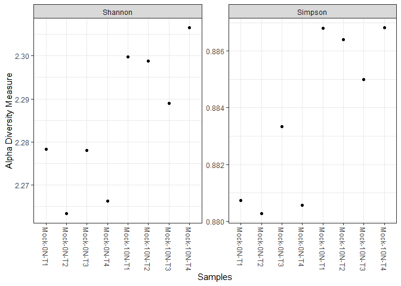<!-- -->

``` r
ps.prop <- transform_sample_counts(ps, function(otu) otu/sum(otu))
ord.nmds.bray <- ordinate(ps.prop, method="NMDS", distance="bray")
```

    ## Run 0 stress 0.0344357 
    ## Run 1 stress 0.2852141 
    ## Run 2 stress 0.06919085 
    ## Run 3 stress 0.03443569 
    ## ... New best solution
    ## ... Procrustes: rmse 1.051781e-05  max resid 1.853283e-05 
    ## ... Similar to previous best
    ## Run 4 stress 0.03443566 
    ## ... New best solution
    ## ... Procrustes: rmse 6.083442e-05  max resid 0.0001102699 
    ## ... Similar to previous best
    ## Run 5 stress 0.0691906 
    ## Run 6 stress 0.06919061 
    ## Run 7 stress 0.03443566 
    ## ... New best solution
    ## ... Procrustes: rmse 5.165101e-06  max resid 1.099001e-05 
    ## ... Similar to previous best
    ## Run 8 stress 0.0691907 
    ## Run 9 stress 0.03443569 
    ## ... Procrustes: rmse 6.169226e-05  max resid 0.0001114939 
    ## ... Similar to previous best
    ## Run 10 stress 0.2162738 
    ## Run 11 stress 0.06919064 
    ## Run 12 stress 0.06919076 
    ## Run 13 stress 0.03443571 
    ## ... Procrustes: rmse 8.23466e-05  max resid 0.000148446 
    ## ... Similar to previous best
    ## Run 14 stress 0.06919085 
    ## Run 15 stress 0.06919071 
    ## Run 16 stress 0.03443568 
    ## ... Procrustes: rmse 4.033581e-05  max resid 7.163713e-05 
    ## ... Similar to previous best
    ## Run 17 stress 0.03443566 
    ## ... New best solution
    ## ... Procrustes: rmse 2.296523e-05  max resid 4.172877e-05 
    ## ... Similar to previous best
    ## Run 18 stress 0.3120129 
    ## Run 19 stress 0.03443568 
    ## ... Procrustes: rmse 2.473857e-05  max resid 3.709167e-05 
    ## ... Similar to previous best
    ## Run 20 stress 0.03443567 
    ## ... Procrustes: rmse 1.417042e-05  max resid 2.363426e-05 
    ## ... Similar to previous best
    ## *** Solution reached

``` r
plot_ordination(ps.prop, ord.nmds.bray, title="Bray NMDS")
```

    ## No available covariate data to map on the points for this plot `type`

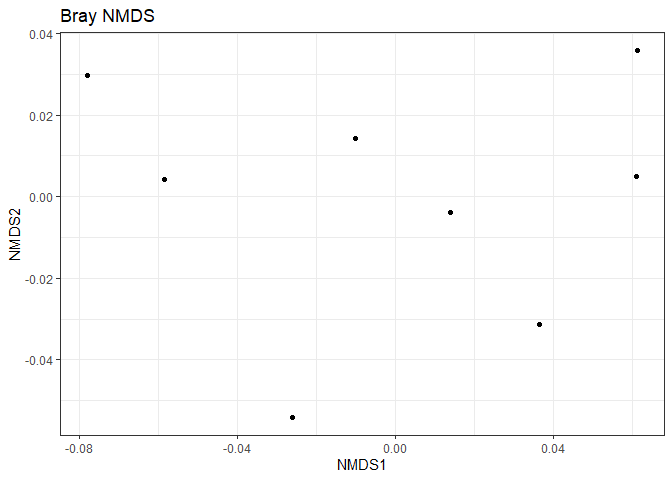<!-- -->

# Abundance plots (family/genus) levels

top x (=20 in demo) no of genus are displayed based on abundance
(However, our standard mock has only 8 bacterial genus present so we
could go with just 9 or 10 as well)

``` r
top20 <- names(sort(taxa_sums(ps), decreasing=TRUE))[1:20]
ps.top20 <- transform_sample_counts(ps, function(OTU) OTU/sum(OTU))
ps.top20 <- prune_taxa(top20, ps.top20)
```

# Family level abundance

``` r
plot_bar(ps.top20, x="Samples", fill="Family")+scale_fill_brewer(palette="Set3")
```

    ## Warning in RColorBrewer::brewer.pal(n, pal): n too large, allowed maximum for palette Set3 is 12
    ## Returning the palette you asked for with that many colors

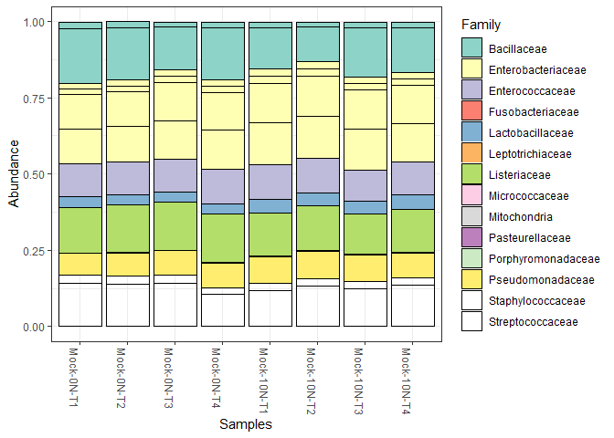<!-- -->

# Genus level abundance

Since we asked for top 20 genus, genus with extremely low number of
reads are displayed in the legends as well. We leave it upto the users
to take away data from here as per their requirements.

``` r
plot_bar(ps.top20, x="Samples", fill="Genus")+scale_fill_brewer(palette="Set3")
```

    ## Warning in RColorBrewer::brewer.pal(n, pal): n too large, allowed maximum for palette Set3 is 12
    ## Returning the palette you asked for with that many colors

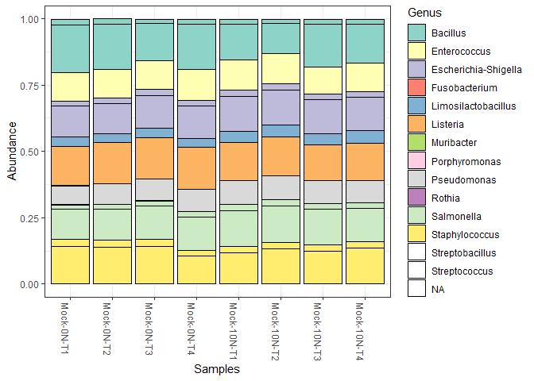<!-- -->

``` r
plot_bar(ps.top20, x="Samples", fill="Genus")+scale_fill_brewer(palette="Set3")+coord_polar()
```

    ## Warning in RColorBrewer::brewer.pal(n, pal): n too large, allowed maximum for palette Set3 is 12
    ## Returning the palette you asked for with that many colors

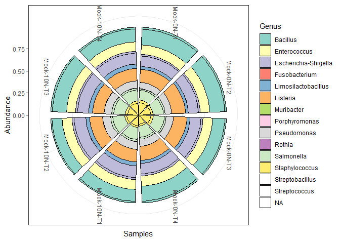<!-- -->

However, we don’t need genus with extremely low number of reads as they
could be due to various artifacts, hence we used the exported csv files
to prune the data a bit in excel. Finally the pruned data was imported
for viewing as well.

# Export to excel and make pivot table and do analysis in Excel based on proportions/relative abundance data

Excel file where we did the pruning could be requested if needed.We
import the selection into the data (data frame) here.

``` r
data <- read.csv("F:/R-DADA2/Final run_github/Abundance Data.csv", header = TRUE)
View(data)
```

Manual colors assigned (one can use a predefined color pallete as well,
depends on what and how many variables a user wants to be color coded in
the plot)

``` r
ggplot(data, aes(x=Samples, y=Relative.Abundance, fill=Genus, label=Relative.Abundance)) +scale_fill_manual(values = c("#83FFD5", "#8B8879", "#CECD2C", "#7CC5CC","#C1CDC1","#D8BFD7","#FEC2CD","#AFDAE7","#C85A5D"))+geom_bar(stat="identity")+facet_wrap(~Group)
```

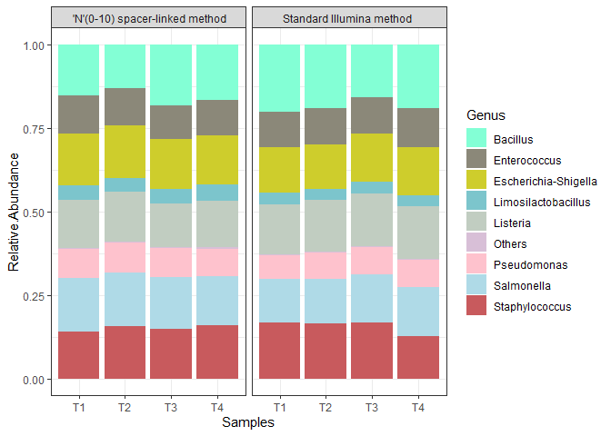<!-- -->
\# Modifying axis labels and aesthetics of the plot

``` r
x <- ggplot(data, aes(x=Samples, y=Relative.Abundance, fill=Genus, label="Relative Abundance")) +scale_fill_manual(values = c("#83FFD5", "#8B8879", "#CECD2C", "#7CC5CC","#C1CDC1","#D8BFD7","#FEC2CD","#AFDAE7","#C85A5D"))+geom_bar(stat="identity")+facet_wrap(~Group)
x +                                 # Modify axis labels
  xlab("Sample") +
  ylab("Relative Abundance (Genus Level)")
```

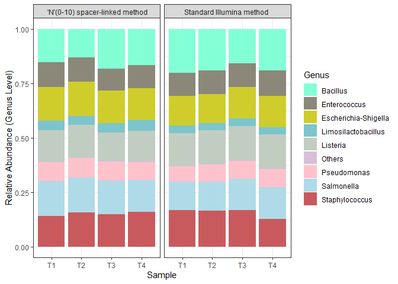<!-- -->

# Saving the recent image in desired publishable format

``` r
ggsave("relative abundance.tiff", plot=last_plot(),device="tiff", path=NULL, scale = 1,width=170,height = NA, units = c("mm"),dpi = 300,limitsize = TRUE,bg=NULL)
```

    ## Saving 170 x 127 mm image

# Rarefaction study (if intended)

Not relevant for our study given we sequenced the samples for more than
enough depth. Anyways we did it just to verify if we sequenced enough to
capture most of the genus in the Mock community standard provided.

``` r
library(vegan)
```

    ## Loading required package: permute

    ## Loading required package: lattice

    ## This is vegan 2.6-2

``` r
rarecurve <- rarecurve((otu_table(ps)), step=1, cex=0.5, label=TRUE, col="blue", xlab = "Sequencing depth (number of reads)", ylab = "ASV's")
```

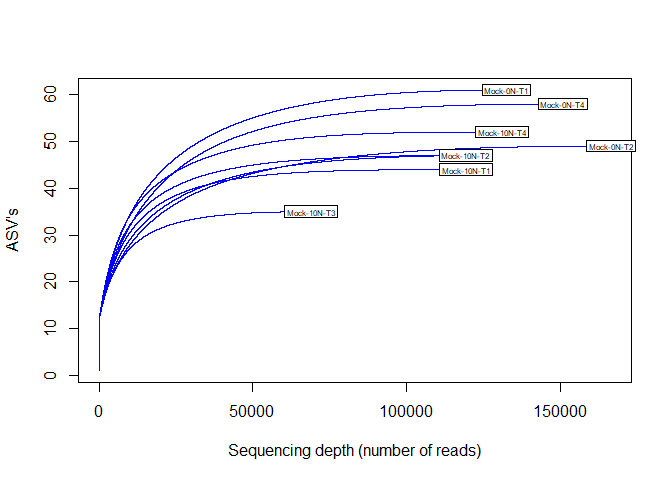<!-- -->

# Chi-squared test in R

We performed the same in GraphPad Prism with high degree of accuracy.

``` r
# dat<-read.delim("clipboard", stringsAsFactors = F)   ##needed when you have the data in clipboard
dat<-matrix(c(18,16,11,11,14,15,3.5,4,15,14,8,8,14,15,0.35,0.32,15,16),ncol = 2,byrow=T) #mean of relative abundance fed manually
colnames(dat)<-c("Standard illumina method","'N' (0-10) spacer-linked method")
row.names(dat)<-c("A","B","C","D","E","F","G","H","I")    #Since we had 8+1 variables after pruning in excel
dat1<-as.table(dat)
chisq.test(dat1, correct = T)
```

    ## Warning in chisq.test(dat1, correct = T): Chi-squared approximation may be
    ## incorrect

    ## 
    ##  Pearson's Chi-squared test
    ## 
    ## data:  dat1
    ## X-squared = 0.28692, df = 8, p-value = 1

That’s all!
